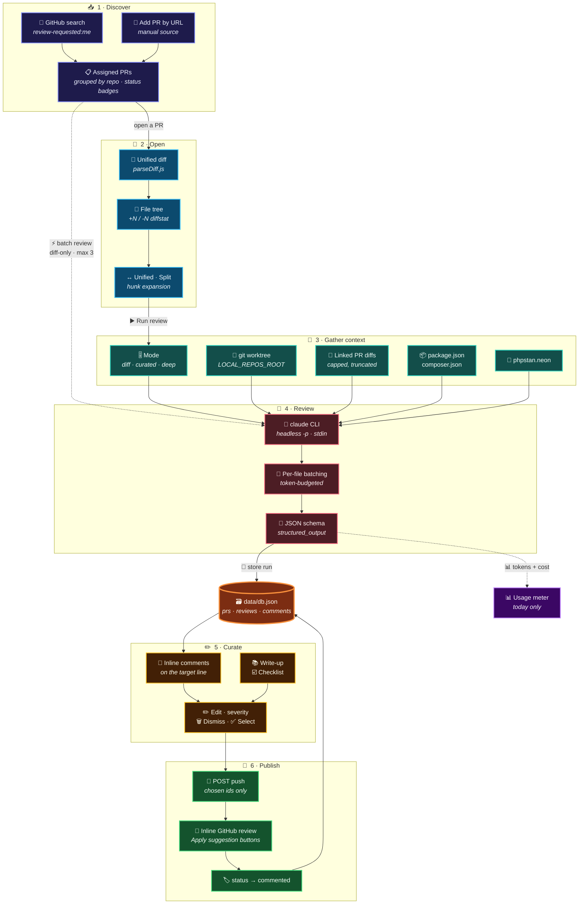
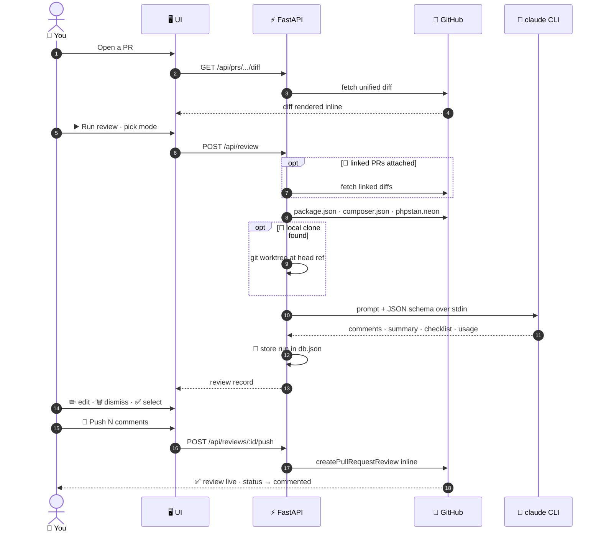
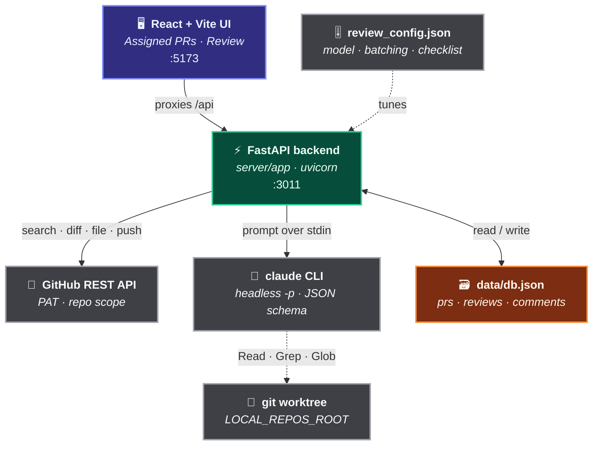
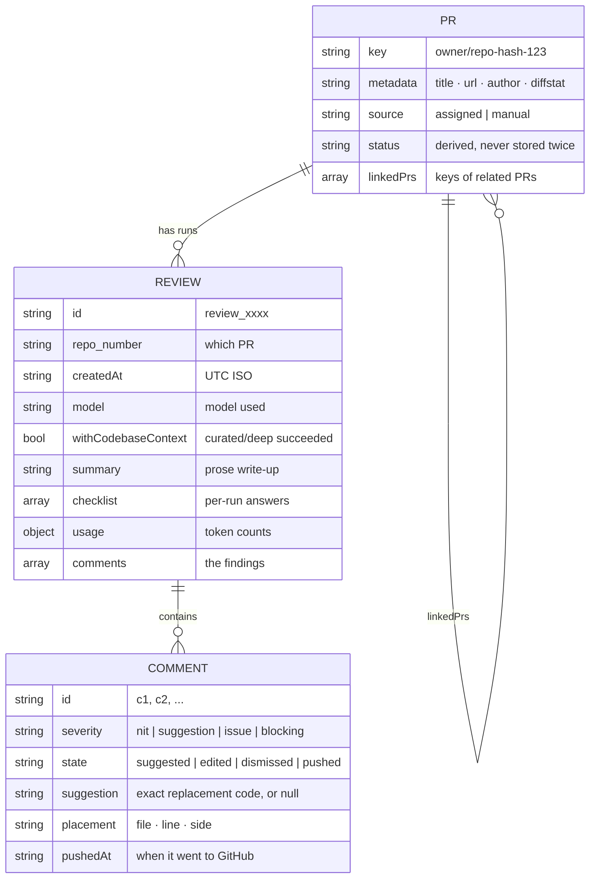

<div align="center">


<br/>


</div>

<div align="center">

### 🧭 &nbsp;Jump to

[**💡 What is this**](#-what-is-this) &nbsp;·&nbsp;
[**✨ Features**](#-features) &nbsp;·&nbsp;
[**🌊 Whole flow**](#-the-whole-flow) &nbsp;·&nbsp;
[**🏗 Architecture**](#-architecture) &nbsp;·&nbsp;
[**🎚 Review modes**](#-review-modes) &nbsp;·&nbsp;
[**🚀 Quick start**](#-quick-start) &nbsp;·&nbsp;
[**⚙️ Configuration**](#️-configuration) &nbsp;·&nbsp;
[**🛰 API**](#-api-surface) &nbsp;·&nbsp;
[**🗃 Data model**](#-data-model) &nbsp;·&nbsp;
[**🩺 Troubleshooting**](#-troubleshooting) &nbsp;·&nbsp;
[**🗺 Roadmap**](#-roadmap)

</div>

---

## 💡 &nbsp;What is this?

> A **local, single-user web app** for reviewing GitHub pull requests with Claude Code.
>
> It surfaces the PRs waiting on your review, runs an AI pass over the diff, lets you
> **edit and curate** every suggested comment, then pushes only the ones you approve — as a
> **real inline GitHub review**, complete with native *Apply suggestion* buttons.

<table>
<tr>
<td width="33%" valign="top">

#### 🔒 &nbsp;Yours alone
No hosting, no accounts, no telemetry. Runs on `localhost`, keeps everything in one JSON file.

</td>
<td width="33%" valign="top">

#### 🎛 &nbsp;You stay in control
Nothing reaches GitHub until you tick the boxes and press **Push**. Automation never pushes.

</td>
<td width="33%" valign="top">

#### 🧠 &nbsp;Context-aware
Local clones, linked PRs, dependency manifests and PHPStan config all feed the review.

</td>
</tr>
</table>

---

## ✨ &nbsp;Features

| | Feature | What you get |
|:--:|---|---|
| 📥 | **Assigned PRs** | Every PR where you're a requested reviewer, plus any added by URL — grouped into collapsible per-repo accordion sections with `unreviewed` / `reviewed` / `commented` status and diffstat gutters. |
| 🔍 | **GitHub-style diff** | Unified **and** split view, a collapsible file tree with `+N`/`-N` counts, per-file collapse, and *"show more lines"* hunk expansion in both directions. |
| 💬 | **Inline AI comments** | Findings render **on the exact line they target**, with severity (`nit` · `suggestion` · `issue` · `blocking`) and a green *Suggested change* block. Commented lines get their own accent highlight. |
| ✏️ | **Fully editable** | Rewrite the text, change the severity, tweak the suggested code, or dismiss a comment — nothing is published until you say so. |
| 🚀 | **One-click push** | Selected comments go up as a single atomic GitHub review: line-attached comments plus native ` ```suggestion ` blocks. Unplaceable comments land in the review body instead of being dropped. |
| 🎚 | **Three review modes** | `Diff only` · `Curated context` · `Deep review` — pick your cost/depth trade-off per run. [See below.](#-review-modes) |
| 📚 | **Review write-up** | Each run stores a prose summary, rendered as markdown with syntax highlighting above the diff. |
| ☑️ | **Review checklist** | A stack-aware checklist (`common` / `frontend` / `backend`) driven by `server/review_config.json`, answered per run. |
| 🔗 | **Linked PRs** | Attach dependent PRs (frontend ↔ backend, app ↔ shared lib) so the review checks **cross-PR consistency** without reviewing the other PR's own code. |
| ⚡ | **Batch review** | Select several PRs inside one repo group and review them all — diff-only, max 3 concurrent, deliberately predictable in cost and time. |
| 📦 | **Dependency awareness** | Reads `package.json` / `composer.json` at the PR's head SHA so comments reason about your *actual* versions — and flag code reinventing a library you already ship. |
| 🐘 | **PHPStan awareness** | Picks up `phpstan.neon(.dist)` so PHP comments match your enforced level and ignored rules instead of a generic stricter standard. |
| 📊 | **Usage meter** | Today's token spend and review count, derived from the day's runs — naturally resets at local midnight, no reset button needed. |
| 🌗 | **Dark / light / system** | Theme toggle persisted in `localStorage`, following the OS by default. |
| 📂 | **Safe worktrees** | Deep reviews run inside a disposable `git worktree` of the PR's head ref — your clone's branch and uncommitted work are never touched. |

---

## 🌊 &nbsp;The whole flow

Everything the app does, end to end — from the PR list to a live GitHub review.



<details>
<summary>🔬 &nbsp;<b>Same flow as a request/response sequence</b></summary>

<br/>



</details>

---

## 🏗 &nbsp;Architecture



<table>
<tr><th align="left">Path</th><th align="left">Role</th></tr>
<tr><td><code>client/</code></td><td>⚛️ React 19 + Vite 5 + Tailwind v4. Dev server proxies <code>/api</code> to <code>:3011</code>. Shared primitives in <code>client/src/components/ui/</code> — <code>Card</code>, <code>Button</code>, <code>Badge</code>, <code>Input</code>, <code>Textarea</code>.</td></tr>
<tr><td><code>server/app/</code></td><td>🐍 FastAPI: <code>main.py</code>, <code>github.py</code>, <code>claude.py</code>, <code>local_repo.py</code>, <code>db.py</code>, <code>concurrency.py</code>, <code>errors.py</code>, <code>routes/</code>.</td></tr>
<tr><td><code>data/db.json</code></td><td>🗃️ The entire datastore. No external DB in this build — SQLite is the planned upgrade path if it ever needs one, with the API as the seam.</td></tr>
<tr><td><code>server/review_config.json</code></td><td>🎚 Model, concurrency, batching, token caps, frontend/backend repo classification, and the review checklist.</td></tr>
</table>

<details>
<summary>🧱 &nbsp;<b>Notable client modules</b></summary>

<br/>

| Module | Purpose |
|---|---|
| `lib/parseDiff.js` | Parses the raw unified diff into files → hunks → lines, matches comments to lines, builds the file tree, computes hidden hunk gaps, and regroups lines into split-view rows. |
| `lib/parseSummary.js` | Splits Claude's prose write-up into its rendered sections. |
| `lib/prsCache.js` | In-memory cache of the last `GET /api/prs`, so the Review screen can read one PR's metadata without refetching the whole list. |
| `lib/formatUsage.js` | Token totals and `1.2K` / `3.4M` formatting for the usage meter. |
| `lib/useTheme.js` · `useIsDarkMode.js` | Dark / light / system theme, persisted in `localStorage`. |
| `components/DiffView.jsx` | The diff table: view toggle, per-file collapse, gap expansion, inline comment rows. |
| `components/CommentCard.jsx` | An editable comment — severity, text, suggestion box, dismiss/restore, push selection. |
| `components/FileTree.jsx` | Collapsible folder tree of changed files with diffstats, scrolls the diff panel on click. |
| `components/PrReviewWriteup.jsx` · `Markdown.jsx` | The prose review write-up, markdown + GFM + syntax highlighting. |
| `components/PrChecklist.jsx` | The per-run review checklist. |
| `components/Sidebar.jsx` · `ThemeToggle.jsx` | Nav shell, usage meter, theme switch. |

</details>

**Routes:** `/` → Assigned PRs &nbsp;·&nbsp; `/review/:owner/:repo/:number` → the Review screen.

---

## 🎚 &nbsp;Review modes

Chosen per run from the Review screen. All three fall back to **diff-only** if a local clone
isn't available or any git step fails — a review never hard-fails over missing context.

<table>
<tr>
<th align="left" width="18%">Mode</th>
<th align="left" width="12%">Needs a clone</th>
<th align="left" width="14%">Cost / time</th>
<th align="left">How it works</th>
</tr>
<tr>
<td>📄 <b>Diff only</b></td>
<td>No</td>
<td>💰 Lowest</td>
<td>One-shot review of the diff itself, no repository tools. Still gets linked-PR, dependency and PHPStan context.</td>
</tr>
<tr>
<td>🧩 <b>Curated context</b></td>
<td>Yes</td>
<td>💰💰 Middle</td>
<td>Checks the PR out locally, runs one <code>git grep</code> pass per changed file to find likely referencing files, and pastes bounded snippets into a single prompt — more context than diff-only without an interactive tool loop.</td>
</tr>
<tr>
<td>🔬 <b>Deep review</b></td>
<td>Yes</td>
<td>💰💰💰 Highest</td>
<td>Runs inside a disposable <code>git worktree</code> with read-only <code>Read</code> · <code>Grep</code> · <code>Glob</code> tools, so Claude explores the real codebase around the diff.</td>
</tr>
</table>

> [!NOTE]
> **Batch review is diff-only on purpose.** One repo per batch, max **3** concurrent runs —
> each review spawns a real `claude` process, so a multi-PR action stays predictable in cost
> and wall-clock time.

---

## 🚀 &nbsp;Quick start

### 📋 &nbsp;Prerequisites

| | Requirement | Notes |
|:--:|---|---|
| 🟩 | **Node.js** | Client + root tooling. Stay on **Vite 5** unless you check `node -v` first. |
| 🐍 | **Python 3** | With a virtualenv at `server/.venv` providing `uvicorn`. |
| 🤖 | **`claude` CLI** | Already logged in. Used headlessly — **never** via `ANTHROPIC_API_KEY`. |
| 🔑 | **GitHub PAT** | `repo` scope. |
| 📂 | **Local clones** | *Optional* — enables curated and deep review modes. |

<details open>
<summary><b>1️⃣ &nbsp;Install JS dependencies</b></summary>

<br/>

```bash
npm install
```

The root `package.json` uses **npm workspaces** — run commands from the repo root, not from
inside `client/`.

</details>

<details open>
<summary><b>2️⃣ &nbsp;Create the Python environment</b></summary>

<br/>

```bash
cd server
python -m venv .venv
.venv\Scripts\activate
pip install -r requirements.txt
cd ..
```

Installs `fastapi`, `uvicorn[standard]`, `httpx`, `python-dotenv`. The `dev:server` script
expects the venv at exactly `server/.venv`.

</details>

<details open>
<summary><b>3️⃣ &nbsp;Configure your environment</b></summary>

<br/>

```bash
cp server/.env.example server/.env
```

Fill in `GITHUB_TOKEN` — see [Configuration](#️-configuration) for the rest.

> [!IMPORTANT]
> Without `GITHUB_TOKEN`, PR endpoints return a **500 with a clear error** rather than
> failing silently.

</details>

<details open>
<summary><b>4️⃣ &nbsp;Run it</b></summary>

<br/>

```bash
npm run dev
```

<div align="center">

🖥️ &nbsp;**UI** → <code>http://localhost:5173</code> &nbsp;&nbsp;·&nbsp;&nbsp; ⚡ &nbsp;**API** → <code>http://localhost:3011</code>

</div>

</details>

### 🧰 &nbsp;Scripts

| Command | What it does |
|---|---|
| `npm run dev` | ▶️ Backend `:3011` + client `:5173`, concurrently |
| `npm run dev:server` | ⚡ Backend only — `nodemon` watches `server/app` and `review_config.json`, and does a **full process restart** (uvicorn's `--reload` is deliberately avoided, [see why](#-troubleshooting)) |
| `npm run dev:client` | 🖥️ Client only |
| `npm run build` | 📦 Production client build → `client/dist` |
| `npm run lint -w client` | 🧹 `oxlint` over the client |

> [!NOTE]
> **No test suite yet**, and nothing is linted on the server side.

---

## ⚙️ &nbsp;Configuration

### 🔐 &nbsp;`server/.env`

| | Variable | Purpose |
|:--:|---|---|
| 🔑 | `GITHUB_TOKEN` | GitHub PAT (`repo` scope) used for every GitHub API call. **Required.** |
| 🔌 | `PORT` | Backend port. Default **`3011`** — [not 3001, on purpose](#-troubleshooting). |
| 📂 | `LOCAL_REPOS_ROOT` | *Optional.* Folder of local clones, one subfolder per repo name (e.g. `F:\GFS_SaaS\gfs-saas-core`). Enables **curated** and **deep** review; unset means diff-only always. |
| 🛠 | `CLAUDE_CLI_PATH` | *Optional.* Explicit path to the `claude` binary when it doesn't resolve on the server process's `PATH`. |

### 🎚 &nbsp;`server/review_config.json`

<details>
<summary><b>Tuning knobs — click to expand</b></summary>

<br/>

| Key | Meaning |
|---|---|
| `reviewModel` | Which Claude model the headless CLI call uses |
| `reviewConcurrency` | Parallel per-batch review calls within a single review run |
| `batchMaxFiles` · `batchMaxDiffTokens` | How changed files are grouped into one review call |
| `estimateCharsPerToken` · `estimateReserveTokens` | Token-budgeting heuristics for that grouping |
| `linkedContextCharCap` | Cap on the combined linked-PR diff context — truncated, never dropped |
| `frontendRepoNames` · `backendRepoNames` | Repo classification, so prompt addenda and the checklist match the stack |
| `checklist` | Checklist items, each grouped `common` / `frontend` / `backend` |

Edits are picked up on the next backend restart — `nodemon` already watches this file.

</details>

### 🔓 &nbsp;Auth model

<table>
<tr><td width="50%" valign="top">

**🤖 Claude**

Shells out to the **already-logged-in `claude` CLI** in headless mode, prompt piped over
**stdin** with a JSON schema for pre-validated structured output.

`ANTHROPIC_API_KEY` is never used.

</td><td width="50%" valign="top">

**🐙 GitHub**

Calls the **REST API directly** with the `GITHUB_TOKEN` PAT (`repo` scope).

Switching to the `gh` CLI would be a deliberate, documented swap — not a silent one.

</td></tr>
</table>

---

## 🛰 &nbsp;API surface

<details open>
<summary><b>📥 &nbsp;Pull requests</b></summary>

<br/>

| Method | Endpoint | Purpose |
|:--:|---|---|
| `GET` | `/api/prs` | Review-requested + manually added PRs, `status` derived from the db. Bounded-concurrency refresh (limit **8**). |
| `GET` | `/api/prs/:owner/:repo/:number/diff` | Raw unified diff text |
| `GET` | `/api/prs/:owner/:repo/:number/file?path=…` | Raw file content at the PR's head SHA — powers hunk expansion |
| `POST` | `/api/added-prs` | Add a PR by URL |
| `DELETE` | `/api/added-prs/:owner/:repo/:number` | Remove a manually added PR |

</details>

<details open>
<summary><b>🔗 &nbsp;Linked PRs</b></summary>

<br/>

| Method | Endpoint | Purpose |
|:--:|---|---|
| `POST` | `/api/prs/:owner/:repo/:number/links` | Link a related/dependent PR (any repo) by URL |
| `DELETE` | `/api/prs/:owner/:repo/:number/links/:o/:r/:n` | Unlink it |

</details>

<details open>
<summary><b>🤖 &nbsp;Reviews</b></summary>

<br/>

| Method | Endpoint | Purpose |
|:--:|---|---|
| `POST` | `/api/review` | Run a review — body `{ repo, number, mode }`, `mode` ∈ `diff` \| `curated` \| `deep`. Stores a new run. |
| `POST` | `/api/reviews/batch` | Batch-review one repo — body `{ repo, numbers[] }`. Diff-only, max 3 concurrent, returns per-PR `ok` / `error`. |
| `GET` | `/api/reviews` | All runs — filterable by `repo`, `number`, comment `state` |
| `GET` | `/api/reviews/:id` | A single run with its comments, summary and checklist |
| `PATCH` | `/api/reviews/:id/comments/:commentId` | Edit text / severity / suggestion / state (including dismiss) |
| `POST` | `/api/reviews/:id/push` | 🚀 Push selected comments to GitHub, mark them `pushed`, bump PR status |

</details>

<details open>
<summary><b>📊 &nbsp;Usage</b></summary>

<br/>

| Method | Endpoint | Purpose |
|:--:|---|---|
| `GET` | `/api/usage` | Today's totals — input / output / cache-read / cache-creation tokens plus `reviewCount`. Derived from today's runs, so it clears at local midnight instead of needing a reset. |

</details>

---

## 🗃 &nbsp;Data model

<div align="center">



</div>

> [!TIP]
> **Status is derived, not stored twice.**
> `commented` if any run has a `pushed` comment → else `reviewed` if there's ≥1 run →
> else `unreviewed`.

---

## 🩺 &nbsp;Troubleshooting

<details>
<summary>🔌 &nbsp;<b>Why port 3011 instead of 3001?</b></summary>

<br/>

On this dev machine, port `3001` is held by a **ghost listener**: `netstat` reports a
listener that answers real HTTP (stale 404s for every route), but the owning PID matches no
live process. Rather than keep fighting it, the backend and the Vite proxy target both moved
to **3011**. Moving back is safe on any machine without that quirk.

</details>

<details>
<summary>🚫 &nbsp;<b>Code changes don't apply, or a review dies with exit code 3221225794</b></summary>

<br/>

`dev:server` deliberately avoids uvicorn's `--reload`. Its file-watcher thread not only
failed to hot-swap here — it broke `POST /api/review` outright with `0xC0000142`
(`STATUS_DLL_INIT_FAILED`), because the backend can't reliably spawn the Node-based `claude`
binary as a child of that worker. `nodemon` does a **full process restart** instead. Don't
re-add `--reload` without re-verifying this machine's behaviour.

</details>

<details>
<summary>🤖 &nbsp;<b>Claude returns prose instead of JSON</b></summary>

<br/>

Two flags do the real work, not prompt wording: `--tools ""` (stops the model wandering the
filesystem in diff-only mode) and `--json-schema` (returns a pre-validated
`structured_output` field). The prompt **must** go over **stdin** — a long multi-line CLI
argument gets silently requoted and corrupted by `cmd.exe` on Windows.

</details>

<details>
<summary>🧊 &nbsp;<b>Deep review hangs with no output</b></summary>

<br/>

Enabling tools requires `--permission-mode bypassPermissions` — otherwise the CLI waits
forever on a permission prompt that can never arrive over piped stdin. Safe here because
`--tools` stays restricted to **read-only** `Read,Grep,Glob` (never `Bash` / `Edit` /
`Write`). Also: `--bare` is **not** a speed-up — it forces API-key auth and breaks the
logged-in CLI session.

</details>

<details>
<summary>📂 &nbsp;<b>Curated / deep review silently ran diff-only</b></summary>

<br/>

Both modes need the repo under `LOCAL_REPOS_ROOT` as a subfolder named exactly after the
repo. If it isn't there, or any git step fails, the run **falls back to diff-only** and
records `withCodebaseContext: false` rather than erroring.

</details>

<details>
<summary>⏱ &nbsp;<b>The PR list is slow</b></summary>

<br/>

`review-requested:` surfaces ~50–100 open PRs on this org, and refreshing each one's full PR
data sequentially took **38s**. Bounded-concurrency fetching (limit **8**) brought it back to
**~7s**. The JSON store itself is fine at this scale — only the GitHub round-trips needed
fixing.

</details>

<details>
<summary>💥 &nbsp;<b>A push failed and nothing was posted</b></summary>

<br/>

The GitHub review API call is **atomic per review** — if a single comment's `line`/`path`
doesn't resolve against the head commit's diff, the whole push fails rather than partially
posting. If that starts happening in practice, per-comment retry/skip is the fix.

</details>

---

## 🗺 &nbsp;Roadmap

| | Phase | Status |
|:--:|---|:--|
| 1 | Queue — review-requested PRs + add-by-URL, diffstat gutters | ✅ &nbsp;Done |
| 2 | Data layer — `data/db.json`, PR status tracking | ✅ &nbsp;Done |
| 3 | Dashboard | ❌ &nbsp;Removed by request |
| 4 | Review screen — Claude call, structured JSON, editable cards | ✅ &nbsp;Done |
| 5 | Push to GitHub — real inline review + suggestions | ✅ &nbsp;Done |
| 6 | Reviews history screen | ❌ &nbsp;Cut from the plan |
| 7 | Auto-review — scheduling / webhooks / polling | ⬜ &nbsp;Deferred by design |

> [!WARNING]
> **Auto-review is deliberately not built.** If it ever is, it must stop at `suggested` —
> automation never calls the push endpoint unless you opt into a specific policy.

---

<div align="center">

### 📚 &nbsp;Further reading

[](CLAUDE.md)
&nbsp;
[](PLAN.md)

<br/>

<sub>Built to run on one machine, for one reviewer — with 🤖 <a href="https://claude.com/claude-code">Claude Code</a></sub>


</div>
